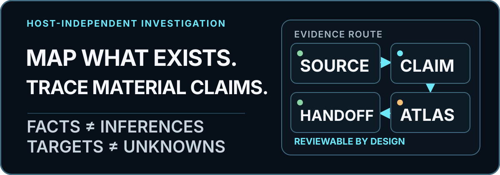
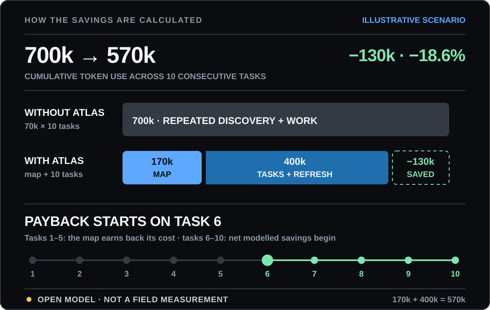
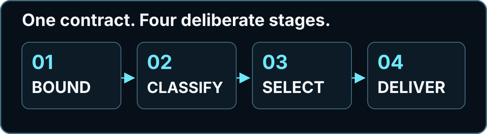

# Project Atlas

<p align="right">
  <strong>English</strong> · <a href="./README.ru.md">Русский</a>
</p>

<p align="center">
  
</p>

<p align="center">
  <strong>Map the project once. Start every later task from verified facts.</strong><br>
  Project Atlas turns a product's structure into an updatable map, ready tasks, and a short working context.<br>
  Codex is the primary adapter. Claude Code is the first additional adapter.
</p>

<p align="center">
  <a href="#30-seconds">30 seconds</a>
  ·
  <a href="#why-this-can-save-tokens-and-time">Economics</a>
  ·
  <a href="#what-you-can-verify-today">Evidence</a>
  ·
  <a href="#five-minutes-to-your-first-request">5-minute start</a>
  ·
  <a href="#what-to-do-with-the-map-next">What next</a>
  ·
  <a href="#technical-reference">Technical reference</a>
</p>

## 30 seconds

A new AI session usually starts from scratch. It finds entry points, reads the
same files, reconstructs relationships, works out the boundaries, and only
then starts the task. Some of that work repeats with every new request.

**Atlas makes that first investigation reusable.** It saves a verifiable map
of code, data, authority, background processes, tests, risks, and product
direction, not a chat summary. Every material claim points to a source file and
has an honest label: `CONFIRMED`, `INFERENCE`, `HYPOTHESIS`, `TARGET`, or
`UNKNOWN`.

Once the map exists, the workflow looks like this:

1. Atlas proposes a ready Future Task: a work card with the outcome, scope,
   deliberate non-goals, and acceptance criteria.
2. For the chosen task, the agent builds a short **Task Context Packet** with
   only the facts, files, risks, and checks it needs.
3. Before editing, it rereads the exact sources instead of blindly trusting an
   old map.
4. After the change, it runs tests and refreshes the map. The next session
   starts from the new verified state.

```text
MAP → READY TASK → NEEDED CONTEXT → CHANGE → TESTS → NEW MAP
```

Atlas **does not change product code while mapping** and **does not start
Future Tasks on its own**. It creates the basis for later work; the user
chooses the specific task.

### What gets easier

| Without Atlas | With Atlas |
| --- | --- |
| Every new session gets to know the project again | Discovered relationships stay with the project and carry across sessions |
| To fix a bug, the agent reads files broadly | The Task Context Packet keeps only the files and facts for the selected task |
| "Add a feature" says nothing about boundaries | The Future Task already has an outcome, scope, non-goals, risks, and acceptance criteria |
| A guess can turn into a confident answer | Facts, inferences, targets, and unknowns remain separate |
| After a change, old knowledge stays in the chat | Sources are checked again and the map is refreshed after tests |
| A handoff to another agent starts with a retelling | Codex and Claude Code read the same host-independent protocol |

### Who needs it

**Use Atlas** when a product has a series of bug fixes, features, refactors,
migrations, audits, or handoffs ahead. The longer the project lives and the
more expensive a mistake is, the more useful saved context becomes.

**Do not install Atlas for one obvious edit** in a small script. The map adds
cost to the first task. It pays back only when the knowledge is used again.

## Why this can save tokens and time

### The main reference point

In the open model's **illustrative scenario** for ten follow-up tasks:

| | Without Atlas | With Atlas |
| --- | ---: | ---: |
| One-time map build | 0 | 170,000 tokens |
| One follow-up task | 70,000 tokens | 35,000 tokens |
| Map refresh after a task | 0 | 5,000 tokens |
| **Total for 10 tasks** | **700,000** | **570,000** |

**Model result: 130,000 fewer tokens, a saving of 18.6%.
The one-time cost breaks even on task 6.**

In the source JSON, this scenario is called `illustrative_mid`. It sits between
the unfavorable and optimistic preset examples, but it is not an average or a
typical user result.

<p align="center">
  
</p>

Without Atlas, repeated orientation is part of the cost of every task. Atlas
has an expensive first payment for the map, but later work starts with a short
context packet and a focused source check.

### How to read the plus and minus signs

- **−18.6%** means a saving: `700,000 → 570,000`, or `130,000` fewer tokens.
- **−51.1%** is the best modelled scenario: `900,000 → 440,000`, or `460,000`
  fewer tokens.
- **+40.0%** means extra cost, not a saving: `600,000 → 840,000`, so Atlas
  uses `240,000` more tokens. In this scenario the map is too expensive and
  there is too little repeated work to reuse.

**Atlas does not promise savings in every project.** It shows the map cost
before work starts, keeps discovered knowledge from being bought again
blindly, and provides an open model for deciding when the investment makes
sense.

[See every assumption, formula, and scenario](./docs/effectiveness.md)

## What you can verify today

### Project Atlas itself

| Check | Public result |
| --- | --- |
| Complete loop | **1** reproducible chain: sources → map → task → patch → test → refreshed map |
| Finding the right layer | **3 files → 1 ready task** in the shared data-writing layer used by the API and background process |
| Verifiable change | **2-line patch → 4 verified outcomes**: two blank values rejected and two valid records saved |
| Depth selection | **3/3** predefined modes selected correctly on synthetic projects |
| Predefined relationships | **26/26** expected correspondences found on the same projects |
| Real savings | **0** published paired campaigns on real repositories; the percentages above are still `MODELLED_ASSUMPTION` |

[Open the complete proven loop](./docs/case-study.md)

### Why the underlying problem is real

- In a **2005** Microsoft study, **66%** of developers reported difficulty
  understanding the reasons behind existing code, **62%** often switched
  between tasks, and **61%** had difficulty learning about changes elsewhere
  in the system.
  [Source](https://www.microsoft.com/en-us/research/publication/software-development-at-microsoft-observed/).
- RepoCoder improved baseline in-file completion by more than **10%** in every
  reported setting through iterative repository-context retrieval.
  [Study](https://arxiv.org/abs/2303.12570).
- CodePlan, using planning and repository context, completed tasks in **5 of 7**
  studied repositories; the baseline completed tasks in **0 of 7**.
  [Study](https://www.microsoft.com/en-us/research/publication/codeplan-repository-level-coding-using-llms-and-planning-2/).
- METR found an important counter-result: experienced developers using AI took
  **19% longer** on the studied tasks. Having AI does not guarantee a speedup;
  context and verification costs matter.
  [Study](https://metr.org/Early_2025_AI_Experienced_OS_Devs_Study-paper.pdf).

These studies support the value of context and planning in related approaches.
They do not measure Atlas. **Still unmeasured** with real users: the exact time
and token savings from Atlas, its context-selection precision, and its effect
on the share of successfully completed tasks.

> [!IMPORTANT]
> Project Atlas is a community project, not an official OpenAI or Anthropic
> product. Project content is processed under the rules of the selected
> service. A structurally valid map can still contain a wrong conclusion, so
> a person must review consequential decisions.

<a id="five-minutes-to-your-first-run"></a>

## Five minutes to your first request

The five minutes begin after the required tools are installed and Codex is
signed in. This is not a promise that the completed map will arrive in exactly
five minutes. Investigation time depends on the project, depth, model, and
permissions.

> [!NOTE]
> On Windows, open WSL first and run this entire section inside it. The commands
> below target a macOS terminal or WSL; native PowerShell is not a verified
> v0.1.1 path.

### 1. Check the tools

Open a terminal:

```bash
codex --version
git --version
python3 --version
rg --version
```

You need Codex CLI, Git, Python 3.10+, and ripgrep (`rg`). All four commands
must print a version.

If a command is missing, use the official setup pages for
[Codex CLI](https://developers.openai.com/codex/cli),
[Git](https://git-scm.com/downloads/),
[Python](https://www.python.org/downloads/), or
[ripgrep](https://github.com/BurntSushi/ripgrep#installation).

Check that Codex is signed in:

```bash
codex login status
```

If it is not, run `codex login` and complete the browser flow.

### 2. Copy the safe demo project

```bash
git clone https://github.com/ddenny-s/project-atlas.git atlas-first-map
cp -R atlas-first-map/tests/fixtures/quick_cli atlas-quick-demo
cd atlas-quick-demo
```

`atlas-quick-demo` is a small program with no network, database, or production
data. Running `ls` in this folder should show `README.md` and `quick_cli`.

### 3. Install Atlas for Codex

```bash
codex plugin marketplace add ddenny-s/project-atlas
codex plugin add project-atlas@project-atlas
codex plugin list
```

The list should contain `project-atlas`.

### 4. Start Codex in that folder

```bash
codex
```

Send:

```text
Use $project-atlas:map-project.
Treat the current folder (`.`) as the project root and do not move above it.
Create and validate a QUICK map with `--project .`.
Do not change project code.
```

Atlas asks its initial product questions, shows a token forecast, inspects the
allowed files, presents a candidate map, and asks its final questions.

### 5. Check the result

The folder will contain:

```text
PROJECT_ATLAS.md
```

A successful structural check ends with a result shaped like this:

```json
{"artifacts": 1, "mode": "QUICK", "status": "valid", "validation": "completion"}
```

`valid` means the required sections and references passed automated checks. It
does not mean every sentence written by the model automatically became true.

### 6. Repeat this on your project

Exit the demo Codex session, open a terminal in the real project folder, and
start `codex` again:

```bash
cd "/replace/with/the/full/path/to/your/project"
codex
```

Send:

```text
Use $project-atlas:map-project.
Treat the current folder (`.`) as the project root and do not move above it.
First recommend QUICK, STANDARD, or FORENSIC, show the token forecast,
and wait for my confirmation. Then create and validate the map.
Do not change project code.
```

<details>
<summary><strong>Short glossary before you start</strong></summary>

- **Repository**: the project folder plus its change history.
- **Project root**: the top folder of the exact code you want mapped.
- **Plugin**: an installable extension for Codex or Claude Code.
- **QUICK**: the short Atlas depth for a small project or first orientation.
- **Token**: a small unit of text used to count model input and output; it is
  not a subscription percentage.
- **Future Task**: a work card Atlas prepared but did not implement.
- **Worker**: code that does background work instead of answering a person
  directly.
- **Fixture**: a small test project or prepared test data.
- **Oracle**: the expected correct answer used to check a result.
- **Task Context Packet**: the small slice of the map needed for one task. By
  default, the agent shows it in chat; ask separately if you want a saved
  `.md` file.
- **Non-goals**: work that is deliberately outside that task.

</details>

## End-to-end example: map → task → change

<p align="center">
  
</p>

A public demo service accepts parcels through an API and processes delivery in
a background worker. Both paths write to one SQLite table.

Before the map:

- the API rejects a blank `parcel_id`;
- the worker bypasses that check;
- the shared writer stores spaces as a real identifier.

Reproducible result:

```text
api blank: rejected (parcel_id is required)
worker blank: ('   ', 'delivered', 'worker')
```

The map separates three statements:

```text
CURRENT · CONFIRMED — the API validates parcel_id.
CURRENT · CONFIRMED — the worker reaches the shared writer without that check.
CURRENT · UNKNOWN   — provider ordering after a timeout is unproved.
```

It then creates `ATLAS-001 · TARGET · READY`: move the required check to the
shared layer, leave retries and administrator authority alone, and check both
blank and valid identifiers.

A public test applies the minimal patch only to a temporary copy of the fixture
and proves:

```text
api blank: rejected (parcel_id is required)
worker blank: rejected (parcel_id is required)
valid: [('parcel-7', 'delivered', 'worker'),
        ('parcel-api', 'accepted', 'api')]
```

The task receipt becomes `VERIFIED`, and its Future Task row becomes
`SUPERSEDED`. Provider ordering remains `UNKNOWN`, so the map does not close a
gap that the change did not investigate.

[Open the complete example: sources → map → Context Packet → patch → test → refreshed map](./docs/case-study.md)

[Frozen map before](./docs/case-study-artifacts/standard-service/before/PROJECT_ATLAS.md)
· [Task Context Packet](./docs/case-study-artifacts/standard-service/ATLAS-001-context-packet.md)
· [Exact patch](./docs/case-study-artifacts/standard-service/ATLAS-001.patch)
· [Frozen map after](./docs/case-study-artifacts/standard-service/after/PROJECT_ATLAS.md)

## What to do with the map next

### Choose one piece of work

In QUICK, open Future Tasks in `PROJECT_ATLAS.md`. In STANDARD or FORENSIC,
start with `ATLAS_INDEX.md`, `LIVE_HANDOFF.md`, and Future Tasks in
`MIGRATION_PLAN.md`.

Before editing, the agent builds a short **Task Context Packet**:

1. the selected task and acceptance criteria;
2. related `CURRENT` claims;
3. exact source files;
4. material `UNKNOWN` items and authority boundaries;
5. required checks;
6. the freshness result for every source link;
7. explicitly excluded context.

This keeps a large map from becoming a huge prompt. The next session receives
only the context needed for the selected task and can see what was left out.

By default, "show a Task Context Packet" means print it in chat, not create a
new file. To carry it into another session, add: "and save it as
`TASK_CONTEXT_<Task-ID>.md`." The end-to-end example deliberately
[saves one as a separate artifact](./docs/case-study-artifacts/standard-service/ATLAS-001-context-packet.md)
so anyone can inspect it.

### Send one plain request

```text
Open the Atlas map and select task <Task ID>.
First check that its source links are still current.
Show a short Task Context Packet: task, related facts, files, unknowns,
checks, and exclusions.
Then implement only that task, run the checks, and refresh the map.
Do not close an UNKNOWN without new evidence.
```

### Where this helps

| Follow-up work | How the map helps |
| --- | --- |
| Fix a bug | Starts from the likely failure path, related state, and tests |
| Add a feature | Separates affected layers from explicit non-goals |
| Run a risky refactor | Preserves current relationships, authority, and rollback paths |
| Hand off a project | Provides verifiable links instead of a retelling from an old chat |
| Start a new AI session | Reduces repeated orientation when the map is fresh |

A stale or shallow map can make work worse. That is why links are rechecked
before the change and the map is refreshed afterwards.

## What happens inside Atlas

1. **BOUND**: define the project root, exclusions, product purpose, and cost of
   error.
2. **FORECAST**: before each large block, show the minimum, typical, and maximum
   model-token estimates.
3. **DISCOVER**: find runtime roots, flows, state, authority, tests, and
   external boundaries.
4. **CLASSIFY**: separate facts, inferences, hypotheses, targets, and unknowns.
5. **ALIGN**: show the candidate map to the owner and ask only questions that
   can still change the map or Future Tasks.
6. **DELIVER**: create the map, Future Tasks, handoff, and structural
   validation result.

There is no fixed question count. Atlas asks small batches while another answer
can still change scope, risk, product direction, or a Future Task. Every
question shows four visible choices; the fourth is "Other: I will write it."

Answer states remain distinct:

- `UNAVAILABLE`: the user does not know;
- `SKIPPED`: the user deliberately skipped;
- `STOP_USER`: the user stopped the survey;
- `UNKNOWN:<stable-id>`: a material gap remains open.

Owner answers have `USER_INPUT` provenance. They can confirm intent, but they
cannot turn a technical guess about current code into `CONFIRMED`.

## Three depth levels

| Depth | Use it for | Result |
| --- | --- | --- |
| `QUICK` | A small project or first orientation | One `PROJECT_ATLAS.md` |
| `STANDARD` | A live application, service, or library | A routed current-state and target-state atlas |
| `FORENSIC` | A critical, old, confusing, or sensitive system | Complete registries, coverage denominators, a source snapshot, and independent challenge |

Repository size does not select depth by itself. Cost of error, live data,
runtime count, state stores, automated decisions, and authority matter more.

[Exact selection rules](./docs/depth-levels.md) ·
[Output contract](./docs/outputs.md)

## Surveys, tokens, and model choice

Before every material block, Atlas shows:

| Estimate | Meaning |
| --- | --- |
| Minimum | Lower working bound when few unknowns are present |
| Typical | Main planning point, not an average across all users |
| Maximum | Checkpoint and reforecast boundary |

For the public `quick_cli` fixture, the current built-in model gives
**2,500 / 3,600 / 5,500 model tokens** for the complete QUICK loop. This is a
forecast based on the allowed-file inventory, not a usage promise.

If the host exposes an exact weekly remainder, Atlas may repeat it. If no exact
signal exists, no weekly line appears. Atlas never converts tokens into an
invented subscription-limit percentage.

### Starting model and effort

Checked against official documentation on **2026-07-27**. This is a starting
point, not an Atlas benchmark:

| Depth | Codex (primary adapter) | Claude Code (additional adapter) |
| --- | --- | --- |
| `QUICK` | GPT-5.6 Terra, `medium` | `sonnet`, `high` |
| `STANDARD` | GPT-5.6 Sol, `high` | `opus`, `high` |
| `FORENSIC` | GPT-5.6 Sol, `xhigh` | `best`, `xhigh` |

OpenAI describes GPT-5.6 Sol as the frontier-capability choice, Terra as the
quality-and-cost balance, and `medium` as a balanced starting point. Raise to
`high`, `xhigh`, or `max` only when evaluation shows a benefit.

In Claude Code, `best` uses Fable 5 when the organization has access and
otherwise selects the latest Opus. The `opus` alias depends on the provider.
It currently selects Opus 5 on the Anthropic API and Claude Platform on AWS;
Opus 5 requires Claude Code 2.1.219+. Claude Code 2.1.207 selected Opus 4.8,
so Atlas records the alias, provider, effective model, and Claude Code version.

`ultracode` is a session-only Claude Code setting, not an Atlas depth. It
combines `xhigh` with dynamic workflows. The `--effort ultracode` form requires
Claude Code 2.1.203+. Use it only for a hard, bounded block inside an explicitly
accepted budget. `ultrathink` deepens one turn without changing API effort.
Codex remains the primary adapter.

Sources:
[OpenAI: Using GPT-5.6](https://developers.openai.com/api/docs/guides/latest-model),
[Claude Code: model configuration](https://code.claude.com/docs/en/model-config),
[Anthropic: model and effort](https://claude.com/blog/claude-model-and-effort-level-in-claude-code),
[Anthropic: dynamic workflows](https://claude.com/blog/introducing-dynamic-workflows-in-claude-code).

## Effectiveness without marketing math

The large figures at the top of this page come from an open model. They are not
observed results. Here is the complete token calculation:

| Scenario, 10 tasks | Map cost | One task without Atlas | One task after the map, including refresh | Total without → with Atlas | Result | Break-even |
| --- | ---: | ---: | ---: | ---: | ---: | ---: |
| Unfavorable · `MODELLED_ASSUMPTION` | 300k | 60k | 54k | 600k → 840k | **+40.0% cost** | Task 50 |
| Illustrative · `MODELLED_ASSUMPTION` | 170k | 70k | 40k | 700k → 570k | **18.6% saving** | Task 6 |
| Optimistic · `MODELLED_ASSUMPTION` | 120k | 90k | 32k | 900k → 440k | **51.1% saving** | Task 3 |

The illustrative row says two different things:

- after the map is built, the modelled cost of each follow-up task falls from
  `70k` to `40k`, a reduction of **42.9%**;
- first, the `170k` spent on the map has to be recovered, so net savings begin
  on task 6.

This is why the unfavorable scenario shows `+40.0%`. Repeated work gets only
`6k` cheaper per task, while the map costs `300k`. After ten tasks, it has not
recovered that cost. On task 50, both sides reach `3,000k`.

Time is modelled separately:

| Scenario, 10 tasks | Map cost | One task without Atlas | One task after the map | Total without → with Atlas | Result | Break-even |
| --- | ---: | ---: | ---: | ---: | ---: | ---: |
| Unfavorable | 240 min | 25 min | 23 min | 250 → 470 min | **+88.0% cost** | Task 120 |
| Illustrative | 120 min | 30 min | 16 min | 300 → 280 min | **6.7% saving** | Task 9 |
| Optimistic | 75 min | 40 min | 12 min | 400 → 195 min | **51.2% saving** | Task 3 |

The formula is:

```text
Without Atlas = number of tasks × full cost of one task

With Atlas = initial map cost
             + number of tasks × (work with prepared context + map refresh)
```

Inputs are in
[`benchmarks/data/modelled/v0.1.0.json`](./benchmarks/data/modelled/v0.1.0.json),
and the calculated results are in
[`modelled-v0.1.0.json`](./benchmarks/data/derived/modelled-v0.1.0.json).
Anyone can replace the assumptions with their own and rerun the calculation.

Break-even is defined only when per-task savings are positive. At zero or
negative savings, the calculator returns `null`: break-even is not reached in
that model. With a zero baseline, relative improvement also returns `null`,
not infinity or an invented percentage.

Atlas does not yet have a published paired campaign on real tasks.
No percentage above is described as a measured result.

[All scenarios, a plain-language explanation, and external research](./docs/effectiveness.md)
· [Technical benchmark contract](./benchmarks/README.md)
· [External evidence registry](./benchmarks/EXTERNAL_EVIDENCE.md)

## Pros, cons, and boundaries

| Pros | Cons |
| --- | --- |
| Verifiable links instead of a confident retelling | Initial investigation uses tokens and time |
| Ready tasks with scope and acceptance criteria | A wrong or stale map can send later work in the wrong direction |
| Portability across sessions and agents | Dynamic code and external services can hide relationships |
| Explicit UNKNOWN items instead of filled gaps | The validator checks structure, not absolute truth |

Atlas is especially useful before a refactor, migration, project handoff,
authority or data audit, or a series of future changes. A small, clear script
with a good README often does not need it.

Safety rules:

- do not read or publish secrets, keys, or real production exports;
- mapping permission is not permission to change code, data, or production;
- expand reading only after a bounded, safe inventory;
- independently recheck high-risk conclusions;
- refresh the map after material changes.

[SECURITY.md](./SECURITY.md) ·
[Evidence model](./core/skill/map-project/references/evidence-model.md)

## Technical reference

The normative contract is not duplicated in this README. It lives under
`core/`; these documents explain and index it:

- [English technical index](./docs/README.md)
- [Protocol](./core/PROTOCOL.md)
- [Methodology and evidence](./docs/methodology.md)
- [Depth levels](./docs/depth-levels.md)
- [Output contract](./docs/outputs.md)
- [Usage examples](./docs/examples.md)
- [Adapters, models, and installation](./docs/adapters.md)
- [End-to-end case study](./docs/case-study.md)

The canonical protocol is host-independent:

```text
core/                 evidence, workflow, safety, and outputs
adapters/codex/       primary native package
adapters/claude-code/ first additional package
```

<details>
<summary><strong>Claude Code, direct installation, updates, and removal</strong></summary>

Claude Code:

```bash
claude plugin marketplace add ddenny-s/project-atlas
claude plugin install project-atlas@project-atlas
```

Invoke it with `/project-atlas:map-project`.

Direct installation on macOS or Linux:

```bash
git clone https://github.com/ddenny-s/project-atlas.git
cd project-atlas
./scripts/install.sh --user-scope
# or:
./scripts/install-claude.sh
```

Direct invocation: `$map-project` for Codex, `/map-project` for Claude Code.

Update a direct installation:

```bash
git pull --ff-only
./scripts/install.sh --user-scope --force
# or:
./scripts/install-claude.sh --force
```

Plugins use the host's normal removal commands. Direct installation in v0.1.1
does not have a separately verified removal or manual-backup recovery command.
Do not improvise with recursive `mv`, `cp`, or `rm`; use the plugin route when
you need a simple lifecycle.

</details>

## Development and release

```bash
python3 scripts/sync_adapters.py --check
python3 -m unittest discover -s tests -v
git diff --check
```

Before a tag or GitHub Release, maintainers separately test disposable clean
profiles, paths with spaces, both adapters, every depth result, and independent
reviews. This manual gate is required before creating a version tag or GitHub
Release and is not a GitHub Actions check. Green CI is necessary, but not
sufficient for release.

[CONTRIBUTING.md](./CONTRIBUTING.md) · [MIT License](./LICENSE)
