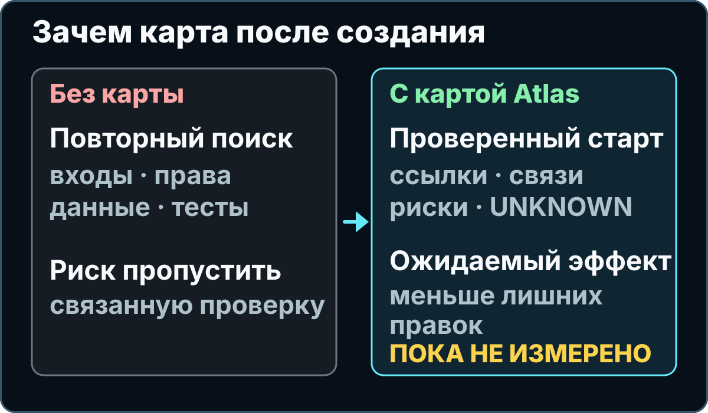
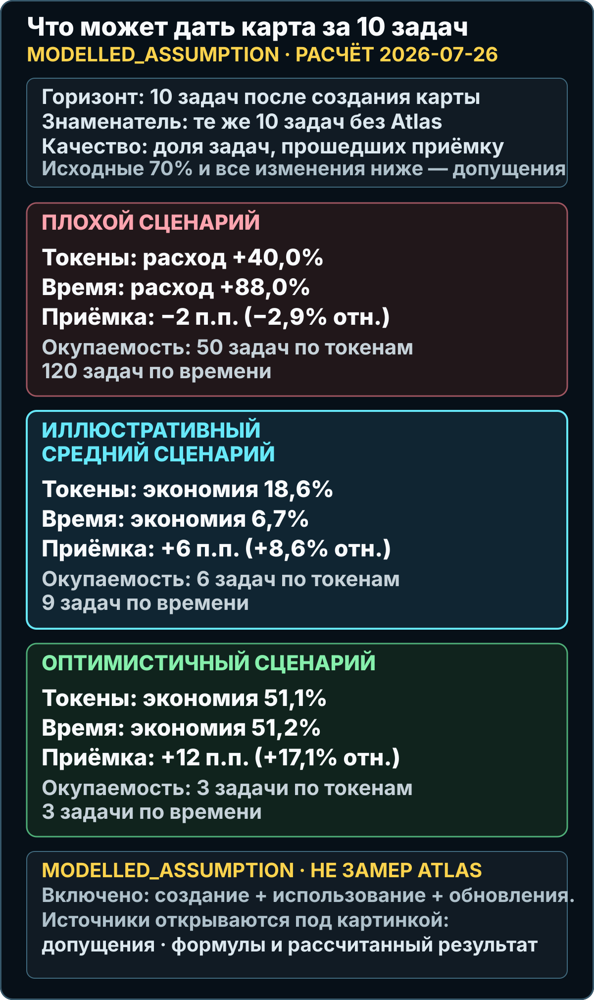

# Project Atlas

<p align="center">
  
</p>

<p align="center">
  <a href="#быстрый-старт-с-codex">Быстрый старт</a>
  ·
  <a href="#что-произойдёт-после-запуска">Как это работает</a>
  ·
  <a href="#опросы-цена-и-модель">Опросы и цена</a>
  ·
  <a href="#как-карта-помогает-в-следующей-задаче">Зачем потом</a>
  ·
  <a href="#эффективность-в-цифрах">Честные цифры</a>
  ·
  <a href="#плюсы-и-минусы">Плюсы и минусы</a>
</p>

Project Atlas помогает разобраться в чужом или забытом проекте с кодом.

Ты даёшь помощнику с ИИ папку проекта. Atlas сначала выясняет, что это за продукт и куда он должен двигаться, затем показывает примерную цену работы в токенах. После этого он просит помощника не угадывать на глаз, а пройти по понятным правилам: найти важные части программы, отделить факты от догадок и приложить ссылки на исходные файлы.

На выходе получается карта с проверяемыми выводами. Затем Atlas показывает её владельцу, задаёт уточняющие вопросы и создаёт столько задач на будущую доработку, сколько действительно следует из найденного. Задачи не запускаются сами: ты выбираешь, что делать дальше.

Если ты впервые на GitHub: **репозиторий** — это папка проекта вместе с историей изменений, а **навык** (`skill`) — набор инструкций для помощника с ИИ. Project Atlas как раз такой навык.

> [!IMPORTANT]
> Project Atlas — проект сообщества, а не официальный продукт OpenAI или Anthropic. Содержимое, которое помощник читает, обрабатывается по правилам выбранного сервиса. Atlas не чинит проект и не меняет продуктовый код: сначала строит карту того, что уже существует. Любой важный вывод всё равно должен проверить человек.

> [!TIP]
> **Первое действие:** открой [быстрый старт из пяти шагов](#быстрый-старт-с-codex). Он ведёт от проверки системы до первого запроса Atlas.

## Зачем это нужно

Представь: ты открыл проект, а внутри 2 000 файлов. Непонятно, откуда запускается программа, где лежат данные, какой файл отвечает за вход пользователя и что сломается после изменения.

Можно просто спросить ИИ: «Объясни этот проект». Он даст быстрый ответ, но ты не всегда поймёшь, где там факт, где догадка и какие части он вообще не посмотрел.

Atlas добавляет правила проверки.

Вот реальный пример из специально созданного тестового проекта без реальных данных:

```text
Обычный ответ ИИ
«Похоже, администратор может менять автоматический статус».

Ответ по правилам Atlas
CONFIRMED — явное переопределение автоматического статуса
может задать только роль admin.

CONFIRMED — без переопределения worker записывает автоматический статус;
с разрешённым переопределением он записывает статус администратора.

UNKNOWN — порядок событий провайдера после повторной попытки не установлен.
```

Проверить источники можно самому:

- правило явного переопределения: [`authority.py`, строки 4–10](./tests/fixtures/standard_service/service/authority.py#L4-L10);
- применение правила перед записью: [`worker.py`, строки 27–41](./tests/fixtures/standard_service/service/worker.py#L27-L41);
- явно записанное неизвестное: [`README` тестового проекта, строки 8–10](./tests/fixtures/standard_service/README.md#L8-L10).

## Что произойдёт после запуска

<p align="center">
  
</p>

1. В начале Atlas спросит владельца о назначении продукта, пользователях, границах, рисках и направлении развития.
2. До каждого большого блока покажет модельный прогноз: минимум, обычный расход и максимум токенов.
3. Определит границы чтения, а затем найдёт точки запуска, основные пользовательские действия, данные, хранилища, фоновые процессы, внешние сервисы, тесты и риски.
4. Пометит каждый важный вывод:
   - `CONFIRMED` — подтверждено источником;
   - `INFERENCE` — логичный вывод из найденных фактов;
   - `HYPOTHESIS` — версия, которую ещё надо проверить;
   - `TARGET` — предложение на будущее, а не текущее состояние;
   - `UNKNOWN` — ответа пока нет.
5. Соберёт черновик карты и проведёт второй опрос: покажет найденное и уточнит пробелы, спорные места и желаемое будущее.
6. Встроит ответы в карту, создаст проверяемый список будущих задач и только после этого запустит финальную проверку.

Результат можно отдать другому разработчику, другой сессии Codex или Claude Code. Им не придётся начинать знакомство с проектом с нуля.

## Опросы, цена и модель

### Почему Atlas задаёт вопросы

Код показывает, **как продукт работает сейчас**, но не всегда объясняет, **зачем он существует и куда должен идти**. Поэтому одного чтения файлов недостаточно.

Atlas проводит два опроса:

- **в начале** — чтобы понять продукт до глубокого исследования;
- **в конце** — чтобы владелец увидел черновик карты и исправил то, чего нет в коде или что помощник понял неверно.

Каждый вопрос показывает ровно четыре варианта ответа. Четвёртый вариант — «Другое — напишу сам». Ответ «не знаю» получает состояние `UNAVAILABLE`, осознанный пропуск — `SKIPPED`, а просьба остановить опрос фиксируется отдельно как `STOP_USER`. Оставшийся материальный пробел записывается как `UNKNOWN:<stable-id>`. Atlas не превращает ни одно из этих состояний в выдуманный факт. Вопросов может быть много: Atlas останавливается не по счётчику, а когда новый ответ уже не меняет границы, риски, направление продукта или будущие задачи.

Ответ владельца получает происхождение `USER_INPUT`. Он может подтвердить цель или желаемое будущее, но не превращает техническую догадку о текущем коде в `CONFIRMED`.

### Что будет с будущими задачами

После финального опроса Atlas создаёт не рекламный список идей, а карточки работы. В каждой есть:

- ожидаемый результат и причина, почему задача появилась;
- затрагиваемые области и то, что специально **не** входит в задачу;
- критерии приёмки;
- зависимости и неизвестные места;
- риски;
- способ проверки результата.

Количество задач заранее не задано. Если карта обосновывает две — будет две. Если продукту реально нужны двадцать три — будет двадцать три. Они помечаются как `TARGET` и не маскируются под уже существующие функции.

### Сколько токенов потребуется

До каждого содержательного блока Atlas показывает три числа:

| Число | Что означает |
| --- | --- |
| Минимум | Нижняя рабочая граница при небольшом числе неизвестных |
| Обычно | Основной ориентир, а не статистическое среднее по пользователям |
| Максимум | Порог остановки и нового прогноза, а не разрешение молча тратить дальше |

Например, встроенный расчёт для маленького публичного учебного проекта в режиме `QUICK` сейчас даёт **2 500 / 3 600 / 5 500 модельных токенов** на весь цикл. Это допущение по размеру разрешённых файлов, а не обещание фактического расхода. Для реального проекта числа пересчитываются по его безопасному инвентарю и показываются отдельно для стартового опроса, инвентаризации, исследования, синтеза задач, финального опроса и проверки.

Если интерфейс показывает точный остаток недельного лимита, Atlas может повторить его отдельной строкой. Если точного сигнала нет, строки не будет. Atlas никогда не переводит токены в процент подписочного лимита.

Проверить расчёт на учебном проекте можно из клона Project Atlas:

```bash
python3 core/skill/map-project/scripts/atlas.py estimate-budget \
  --project tests/fixtures/quick_cli \
  --mode QUICK
```

### На какой модели и «уме» запускать

Стартовые рекомендации на **26 июля 2026 года**:

| Режим Atlas | Codex — основной адаптер | Claude Code — дополнительный адаптер |
| --- | --- | --- |
| `QUICK` | GPT-5.6 Terra, `medium` | `sonnet`, `high` |
| `STANDARD` | GPT-5.6 Sol, `high` | `opus`, `high` |
| `FORENSIC` | GPT-5.6 Sol, `xhigh` | `best`, `xhigh` |

Это стартовая точка по рекомендациям провайдеров, а не доказанный Atlas benchmark. Anthropic советует начинать с обычного effort выбранной модели: брать более крупную модель для действительно сложной или неоднозначной задачи, а effort повышать, когда помощник пропустил файлы, тесты или проверку. `max` имеет смысл только для редкого сложного блока, когда качество важнее расхода и проверка показала реальную пользу. Включать его на весь Atlas по умолчанию не стоит.

Названия меняются. В Claude Code `best` использует Fable 5, если у организации есть к ней доступ; иначе выбирается последняя модель Opus. На Anthropic API и Claude Platform on AWS псевдоним `opus` сейчас выбирает Opus 5; таблица других провайдеров отличается. Opus 5 требует Claude Code 2.1.219 или новее. Зафиксированный запуск Claude Code 2.1.207 — исторический снимок, а не текущий контракт: в этой версии `opus` выбирал Opus 4.8 на Anthropic API и Claude Platform on AWS. Поэтому Atlas записывает выбранный псевдоним, провайдера, фактически использованную модель и версию Claude Code.

Для самого сложного содержательного блока можно включить `ultracode`, если этот режим доступен и дополнительный расход укладывается в рамки явно согласованного бюджета. Это настройка Claude Code только на текущую сессию, а не новый уровень effort: она включает `xhigh` и динамические рабочие процессы. Форма `--effort ultracode` поддерживается начиная с Claude Code 2.1.203. Это не глобальная настройка и не режим Atlas по умолчанию; Codex остаётся основным адаптером. Для одноразового более глубокого рассуждения в одном ходе используется точное ключевое слово `ultrathink`; оно не меняет effort, передаваемый API.

Основание рекомендаций: [OpenAI Model guidance](https://developers.openai.com/api/docs/guides/latest-model), [Claude Code model configuration](https://code.claude.com/docs/en/model-config), [Anthropic о выборе модели и effort](https://claude.com/blog/claude-model-and-effort-level-in-claude-code) и [Anthropic о dynamic workflows](https://claude.com/blog/introducing-dynamic-workflows-in-claude-code).

## Как карта помогает в следующей задаче

<p align="center">
  
</p>

Главная польза `PROJECT_ATLAS.md` начинается в следующей задаче: новый запрос к ИИ получает проверенный контекст вместо нового раунда догадок.

Допустим, ты пишешь:

```text
Добавь вход через Google и не сломай обычный вход по email.
```

Без карты помощник обычно начинает заново искать по проекту: где роуты, где права, где база, где тесты. Он может быстро найти похожий файл и начать править его, но пропустить соседнюю проверку прав или второй путь входа.

С картой помощник делает иначе:

1. Открывает раздел про вход пользователя, права доступа, хранилище и тесты.
2. Берёт ссылки на конкретные файлы из карты, а не ищет всё с нуля.
3. Смотрит, какие выводы были `CONFIRMED`, а какие помечены как `UNKNOWN`.
4. Старается ограничить изменения связанными файлами, потому что видит границы подсистемы.
5. Запускает проверки, которые карта уже записала как важные для этого проекта.
6. Обновляет карту, если устройство проекта после правки изменилось.

Если Atlas уже сформировал будущие задачи, ты можешь выбрать одну карточку по `Task ID`. Помощник получает готовые границы, критерии приёмки, зависимости, риски и способ проверки. Он всё равно обязан перепроверить ссылки по текущему коду: карта — проверяемая стартовая точка, а не вечная истина.

Полный цикл выглядит так:

```text
карта CURRENT → задача TARGET → повторная проверка источников
→ изменение продукта → тесты → обновлённая карта
```

Atlas должен помогать в самой работе, а не просто делать документацию красивее:

| Задача после карты | Ожидаемый эффект |
| --- | --- |
| Исправить баг | Начать с вероятного места причины и связанных тестов |
| Добавить фичу | Понять, какие слои надо трогать, а какие лучше не трогать |
| Передать проект другому человеку | Дать не пересказ в чате, а проверяемые ссылки на код |
| Начать новую сессию ИИ | Не тратить первые сообщения на повторное знакомство |
| Проверить рискованную правку | Увидеть права, данные, внешние сервисы и неизвестные места до изменения |

Где может стать хуже: если карта устарела, неполная или сделана слишком поверхностно, помощник может опереться на старую картину проекта. Поэтому Atlas заставляет писать ссылки на источники, явно помечать `UNKNOWN` и после важных изменений обновлять карту.

### Копируемый запрос для следующей задачи

```text
Открой PROJECT_ATLAS.md. Если карта создана в режиме STANDARD или FORENSIC, также открой ATLAS_INDEX.md, LIVE_HANDOFF.md и раздел Future Tasks в MIGRATION_PLAN.md. До изменений проверь, что ссылки из карты ведут к текущим файлам и не устарели. Выполни задачу <Task ID или описание>. Соблюдай её scope, non-goals и acceptance criteria. Проверь затронутые связи и тесты. После изменений обнови карту и снова проверь её.
```

## Что ты получишь

Для первого запуска лучше выбрать `QUICK`. В корне проекта появится один файл:

```text
PROJECT_ATLAS.md
```

В нём будут:

- простое описание продукта;
- главные части программы и связи между ними;
- движение данных;
- подтверждённые факты со ссылками на файлы;
- риски и неизвестные места;
- команды, которыми можно повторить важные проверки;
- ответы двух опросов и их влияние на карту;
- прогноз и фактический расход по большим блокам, если интерфейс даёт телеметрию;
- проверяемые задачи на будущую доработку;
- следующий безопасный шаг.

После успешной проверки Atlas вернёт результат такого вида:

```json
{"artifacts": 1, "mode": "QUICK", "status": "valid", "validation": "completion"}
```

`valid` означает, что автоматическая проверка приняла устройство карты: нужные разделы на месте, ссылки ведут только к разрешённым источникам, а команды записаны в допустимом формате. Это **не** означает, что каждое предложение ИИ автоматически стало правдой.

## Быстрый старт с Codex

Codex — основной адаптер Project Atlas. Claude Code поддерживается вторым готовым адаптером.

### 1. Проверь систему и нужные программы

Этот быстрый старт рассчитан на macOS, Linux или Windows с WSL — Linux-окружением внутри Windows. На обычной Windows без WSL встроенная проверка останавливается, потому что там нет нужных безопасных файловых операций.

Открой приложение «Терминал» и выполни:

```bash
codex --version
git --version
python3 --version
rg --version
```

Все четыре команды должны напечатать номер версии. Python должен быть версии **3.10 или новее**. `rg` — это программа ripgrep для быстрого текстового поиска по файлам.

Если терминал пишет `command not found`, установи недостающую программу из официального источника:

- [Codex CLI](https://developers.openai.com/codex/cli/);
- [Git](https://git-scm.com/downloads);
- [Python](https://www.python.org/downloads/);
- [ripgrep (`rg`)](https://github.com/BurntSushi/ripgrep#installation).

Запусти `codex` один раз и войди в аккаунт, затем закрой сессию.

### 2. Открой проект

Если проект уже лежит на компьютере, перейди в его верхнюю папку:

```bash
cd "/полный/путь/к/твоему/проекту"
```

Если хочешь сначала потренироваться на безопасном тестовом проекте, эти команды можно скопировать целиком:

```bash
git clone https://github.com/ddenny-s/project-atlas.git atlas-first-map
cp -R atlas-first-map/tests/fixtures/quick_cli atlas-quick-demo
cd atlas-quick-demo
```

Вторая команда копирует только маленький учебный проект в отдельную папку. Так Codex не перепутает его со всем репозиторием Project Atlas. Проверь текущую папку:

```bash
pwd
ls
```

Для тренировочного проекта команда `ls` должна показать `README.md` и папку `quick_cli`.

### 3. Установи плагин

Открой терминал и выполни две команды:

```bash
codex plugin marketplace add ddenny-s/project-atlas
codex plugin add project-atlas@project-atlas
```

Плагин — это дополнение для Codex. Первая команда добавляет его каталог, вторая устанавливает сам Atlas.

### 4. Запусти Codex из этой папки

```bash
codex
```

### 5. Отправь один запрос

```text
Используй $project-atlas:map-project. Считай текущую папку (`.`) корнем проекта и не поднимайся в родительские папки или к внешнему Git-корню. Создай и проверь QUICK-карту именно этой папки, используя `--project .`. Не меняй код проекта.
```

Сначала Atlas задаст небольшой блок вопросов. Каждый вопрос будет выглядеть примерно так:

```text
Для кого в первую очередь существует этот продукт?
A. Для одного владельца
B. Для внутренней команды
C. Для внешних клиентов
D. Другое — напишу сам
```

После ответов Atlas покажет прогноз токенов по блокам. Ты можешь продолжить, выбрать более дешёвый режим или остановиться. В конце Atlas покажет черновик карты и задаст второй набор вопросов. Их число заранее не ограничено: если ответы уже ничего важного не меняют, опрос заканчивается; если остаются реальные пробелы, он продолжается.

После успешного завершения именно в текущей папке `atlas-quick-demo` появится `PROJECT_ATLAS.md` с картой и будущими задачами, а финальная проверка вернёт JSON со значениями `"mode": "QUICK"` и `"status": "valid"`.

Точного обещания по времени нет: продолжительность QUICK ещё не измерялась и зависит от размера проекта и разрешений. Codex может попросить разрешение прочитать файл или выполнить безопасную команду. Прочитай такой запрос перед подтверждением — это не обязательно ошибка или зависание.

Если что-то не получилось:

- любая из четырёх команд шага 1 не найдена — установи недостающую программу, открой новый терминал и повтори все четыре проверки;
- Python старее 3.10 — обнови Python, иначе Atlas не запустит встроенную проверку;
- `destination path ... already exists` после `git clone` — не считай существующую папку правильным клоном вслепую. Возьми свободные имена: `git clone https://github.com/ddenny-s/project-atlas.git atlas-first-map-2`, затем `cp -R atlas-first-map-2/tests/fixtures/quick_cli atlas-quick-demo-2` и `cd atlas-quick-demo-2`;
- Codex открыл не тот проект — выйди из сессии, проверь `pwd` и `ls`, затем снова запусти `codex`;
- Codex не видит навык — выполни `codex plugin list` и найди `project-atlas`; если его нет, повтори две команды установки из шага 3, затем начни новую сессию;
- проверка жалуется на Python, `rg`, систему или права — сначала исправь окружение; правка карты это не вылечит;
- проверка нашла ошибку только в `PROJECT_ATLAS.md` — не меняй код проекта. Напиши: `Исправь только карту по сообщению проверки и проверь её снова.`

После успеха просмотри `PROJECT_ATLAS.md`. Если проект важный, попроси Atlas перейти в режим `STANDARD` или `FORENSIC`.

<details>
<summary><strong>Установка для Claude Code</strong></summary>

Claude Code — первый дополнительный помощник с ИИ, для которого есть готовая версия Atlas:

```bash
claude plugin marketplace add ddenny-s/project-atlas
claude plugin install project-atlas@project-atlas
```

Запуск:

```text
/project-atlas:map-project
```

Правила доказательств, режимы и формат результата те же. Набор доступных инструментов и разрешений у Codex и Claude Code может отличаться.

</details>

<details>
<summary><strong>Прямая установка без каталога плагинов</strong></summary>

Этот способ рассчитан на macOS или Linux и дополнительно требует Bash и `diff`. Если тебе важно удалять Atlas одной готовой командой, используй установку как плагин выше.

Для Codex на macOS или Linux:

```bash
git clone https://github.com/ddenny-s/project-atlas.git
cd project-atlas
./scripts/install.sh --user-scope
```

После этого вызывай навык как `$map-project`.

Для Claude Code из той же папки:

```bash
./scripts/install-claude.sh
```

Вызов напрямую установленной версии для Claude Code: `/map-project`.

Установщики не перезаписывают существующую копию молча. Обновление с `--force` сначала сохраняет резервную копию.

</details>

<details>
<summary><strong>Как обновить Atlas или удалить плагин</strong></summary>

Обновить плагин Codex:

```bash
codex plugin marketplace upgrade project-atlas
codex plugin remove project-atlas@project-atlas
codex plugin add project-atlas@project-atlas
```

Удалить плагин Codex:

```bash
codex plugin remove project-atlas@project-atlas
codex plugin marketplace remove project-atlas
```

Обновить или удалить плагин Claude Code:

```bash
claude plugin marketplace update project-atlas
claude plugin update project-atlas@project-atlas

claude plugin uninstall project-atlas@project-atlas
claude plugin marketplace remove project-atlas
```

Обновить прямую установку из уже скачанной папки:

```bash
git pull --ff-only
./scripts/install.sh --user-scope --force
# или для Claude Code:
./scripts/install-claude.sh --force
```

При обновлении старая версия сохраняется здесь:

```text
Codex:       $HOME/.agents/.skill-backups/project-atlas/
Claude Code: ${CLAUDE_CONFIG_DIR:-$HOME/.claude}/.skill-backups/project-atlas/
```

Установщик печатает точный путь созданной резервной копии. Обычно он сам откатывает неудачное обновление. Если он прямо просит ручное восстановление, не выбирай копию только по времени в имени. Сначала открой её `SKILL.md` и убедись, что это нужная версия Project Atlas.

Если автоматический откат не сработал и установщик просит ручное восстановление, **остановись**. В v0.1.0 ещё нет отдельно проверенной команды ручного восстановления. Не запускай случайные `mv`, `cp` или `rm -r`: промежуточная ссылка в пути может направить такую команду не в ту папку. Сохрани напечатанный путь резервной копии и [сообщи об ошибке](https://github.com/ddenny-s/project-atlas/issues/new).

У прямой установки пока также нет отдельно проверенной команды удаления. Это известный минус v0.1.0. Если нужна простая установка, обновление и удаление, выбирай плагин: его удаляют штатные команды Codex или Claude Code выше. Резервные копии специально не удаляются автоматически.

</details>

## Три режима глубины

| Режим | Когда выбрать | Что получится |
| --- | --- | --- |
| `QUICK` | Небольшой проект или первое знакомство | Один понятный `PROJECT_ATLAS.md` |
| `STANDARD` | Живое приложение, сервис или библиотека | 12 документов о текущем состоянии, потоках, рисках, цели, миграции и передаче работы |
| `FORENSIC` | Критичная, старая или запутанная система, где ошибка дорого стоит | 13 тематических документов и `SOURCE_SNAPSHOT.json` со снимком разрешённых источников |

Размер проекта — лишь один фактор. Atlas также учитывает чувствительность данных, цену ошибки, количество процессов и хранилищ, внешние сервисы, автоматические решения и сложность прав доступа.

Подробнее: [правила выбора глубины](./docs/depth-levels.md) и [контракт результата](./docs/outputs.md).

## Эффективность в цифрах

<p align="center">
  
</p>
<p align="center">
  <a href="./benchmarks/data/modelled/v0.1.0.json">Допущения</a> ·
  <a href="./benchmarks/data/derived/modelled-v0.1.0.json">Формулы и рассчитанный результат</a>
</p>

Цифры ниже разделены на три вида. Их нельзя смешивать:

| Метка | Что это значит |
| --- | --- |
| `MODELLED_ASSUMPTION` | Расчётный сценарий с открытыми допущениями; полезен для планирования, но ещё не наблюдался |
| `MEASURED` | Парные запуски на одинаковой задаче, модели, версии, разрешениях и свежих сессиях |
| `EXTERNAL_EVIDENCE` | Результат чужого исследования похожего подхода; объясняет, почему гипотеза разумна, но не доказывает эффект Atlas |

### Расчётная модель Atlas

На **2026-07-26** у Atlas нет опубликованной парной кампании, по которой можно было бы назвать эффект измеренным. Ниже три сценария `MODELLED_ASSUMPTION`: плохой, иллюстративный средний и оптимистичный. Все исходные допущения можно [открыть напрямую в JSON](./benchmarks/data/modelled/v0.1.0.json).

Горизонт — десять сопоставимых задач после одного создания карты. Для токенов и времени знаменатель — суммарный расход тех же десяти задач без Atlas. Основа качества — доля задач, которые прошли заранее заданные критерии приёмки (`contract_pass`); исходные 70% и значения сценариев тоже являются допущениями.

| Сценарий | Токены за 10 задач | Время за 10 задач | Прохождение приёмки | Окупаемость |
| --- | ---: | ---: | ---: | ---: |
| Плохой · `MODELLED_ASSUMPTION` | расход **+40,0%** | расход **+88,0%** | `70% → 68%`: **−2 п.п. / −2,9% относительно** | 50 задач по токенам, 120 по времени |
| Иллюстративный средний · `MODELLED_ASSUMPTION` | экономия **18,6%** | экономия **6,7%** | `70% → 76%`: **+6 п.п. / +8,6% относительно** | 6 задач по токенам, 9 по времени |
| Оптимистичный · `MODELLED_ASSUMPTION` | экономия **51,1%** | экономия **51,2%** | `70% → 82%`: **+12 п.п. / +17,1% относительно** | 3 задачи по токенам, 3 по времени |

Числа можно пересчитать. Входы для иллюстративного среднего сценария:

```text
создание карты:                    170 000 токенов
задача без Atlas:                   70 000 токенов
задача с картой:                    35 000 токенов
обновление карты после задачи:       5 000 токенов

без Atlas за 10 задач:              700 000 токенов
с Atlas за 10 задач:                170 000 + 10 × (35 000 + 5 000)
                                      = 570 000 токенов
экономия:                           (700 000 − 570 000) / 700 000
                                      = 18,6%
относительное улучшение приёмки:    (76 − 70) / 70 = 8,6%
```

Общие формулы:

```text
стоимость Atlas(N) = создание + N × (использование + обновление)
экономия % = (стоимость без Atlas − стоимость Atlas) / стоимость без Atlas × 100
окупаемость = ceil(создание / экономия на одной задаче)
изменение результата, п.п. = результат Atlas − результат без Atlas
относительное изменение = (результат Atlas − результат без Atlas) / результат без Atlas × 100
```

Окупаемость определена только при экономии на одной задаче больше нуля. При нулевой или отрицательной экономии калькулятор возвращает `null`: в этой модели окупаемость не достигается. Относительное изменение определено только при результате без Atlas больше нуля; при нулевом baseline калькулятор также возвращает `null`, а не бесконечность или выдуманный процент.

Все входные числа лежат в [`benchmarks/data/modelled/v0.1.0.json`](./benchmarks/data/modelled/v0.1.0.json), рассчитанный результат — в [`modelled-v0.1.0.json`](./benchmarks/data/derived/modelled-v0.1.0.json), а калькулятор — в [`benchmark_atlas.py`](./scripts/benchmark_atlas.py). Любой человек может заменить допущения своими.

Если подставить именно эти допущения:

- одна следующая задача не окупает создание карты ни в одном из трёх сценариев;
- в иллюстративном среднем сценарии токены окупаются с 6-й задачи, а время — с 9-й;
- в плохом сценарии Atlas остаётся дороже и после 10 задач. Нерелевантная или устаревшая карта может сделать результат хуже, поэтому ссылки надо перепроверять, а карту обновлять.

### Что проверяют синтетические тесты Atlas

На публичных синтетических проектах можно воспроизвести две проверки механики. Это **не** `MEASURED` benchmark эффективности Atlas:

| Проверка | Результат | Что это доказывает |
| --- | ---: | --- |
| Выбор глубины | `3/3 = 100%` | Для трёх специально созданных тестовых проектов Atlas выбрал ожидаемые `QUICK`, `STANDARD` и `FORENSIC` |
| Поиск заранее заданных соответствий | `26/26 = 100%` заданного списка | На этих проектах найдены все 26 пар «категория → файл» — 18 уникальных файлов. Лишние или ошибочные находки этот тест не считает |

Проверить это можно тестами:

```bash
python3 -m unittest tests.test_atlas_cli
python3 scripts/sync_adapters.py --check
```

Точные проверки лежат в [`test_atlas_cli.py`](./tests/test_atlas_cli.py) и [`test_adapter_packaging.py`](./tests/test_adapter_packaging.py). Они доказывают работу этих конкретных механизмов, но не процент успеха на реальном проекте.

### Что показывают близкие исследования

Это `EXTERNAL_EVIDENCE`, а не результат Atlas:

| Подход | Токены или время | Результат |
| --- | ---: | ---: |
| SWE-ContextBench v3 от 2026-05-06, заранее выбранный правильный `oracle-summary/context`, Claude Sonnet 4.5 (`n=376`) | **−20,5%** токенов, **−18,5%** времени | **+3,72 п.п. / +18,9% относительно** решённых задач |
| SWE-ContextBench v3 от 2026-05-06, заранее выбранный правильный `oracle-summary/context`, GPT-5.3 Codex (`n=376`) | **−16,2%** токенов, время **+3,7%** хуже | **+1,34 п.п. / +5,9% относительно** |
| Репозиторный граф, Agentless + GPT-4o | токены **+11,7%** хуже | **+2,34 п.п. / +8,6% относительно** решённых задач |
| Репозиторный граф, Agentless + Claude 3.5 Sonnet | токены **+12,8%** хуже | **+2,66 п.п. / +9,6% относительно** |

В SWE-ContextBench свободный выбор сводки не воспроизвёл результат заранее выбранного правильного контекста. Atlas пока не доказал, что сам выбирает контекст такого же качества. Поэтому эти проценты нельзя переносить на Atlas как ожидаемый эффект.

В двух строках про репозиторный граф качество выросло, но токенов понадобилось **больше**. Поэтому Atlas считает качество, токены и время отдельно. Источники и арифметика: [`benchmarks/EXTERNAL_EVIDENCE.md`](./benchmarks/EXTERNAL_EVIDENCE.md).

### Как появятся настоящие проценты Atlas

В репозитории есть приватно-безопасный парный benchmark. Для каждой задачи он требует одинаковые байты публичного проекта, один oracle, одинаковую модель и effort, свежие сессии, одинаковые разрешения и чередующийся порядок `BASELINE`/`ATLAS_USE`. Ошибочные запуски не выбрасываются. Элементы oracle хранятся только как SHA-256, а build/use/refresh связываются по хешам карты и времени.

```bash
PYTHONDONTWRITEBYTECODE=1 python3 scripts/benchmark_atlas.py model \
  --input benchmarks/data/modelled/v0.1.0.json \
  --check benchmarks/data/derived/modelled-v0.1.0.json

PYTHONDONTWRITEBYTECODE=1 python3 -m unittest \
  tests.test_effectiveness_contract
```

Пока такая кампания не опубликована, проценты в первой таблице остаются честно помеченной моделью.

## Плюсы и минусы

### Плюсы

- Важные выводы можно открыть и проверить по исходным файлам.
- Догадки не маскируются под факты.
- Неизвестные места остаются видимыми.
- Следующей сессии или человеку проще продолжить работу.
- Один протокол работает в готовых версиях для Codex и Claude Code.
- Границы чтения, приватность и нагрузка задаются до глубокого исследования.

### Минусы

- Глубокая карта требует больше времени и места в рабочей памяти помощника. Для маленького скрипта Atlas может быть лишним.
- ИИ всё ещё может неверно понять код. Автоматическая проверка проверяет устройство карты и источники, а не смысл каждого предложения.
- Карта устаревает после изменений в коде, конфигурации или инфраструктуре.
- Скрытые настройки работающей системы и внешние сервисы могут остаться неизвестными.
- У прямой установки v0.1.0 пока нет отдельно проверенных команд ручного восстановления и удаления; для простого управления лучше ставить Atlas как плагин.
- Важную карту нужно читать и проверять человеку.

## Когда Atlas особенно полезен

- Ты впервые открыл большой проект.
- Разработчик ушёл, а документация устарела.
- Перед рефакторингом нужно понять, что реально связано.
- Надо передать работу другому человеку или помощнику с ИИ.
- В проекте есть деньги, персональные данные, права доступа или другие дорогие риски.
- Нужно расследовать старую систему, не меняя её вслепую.

Для маленького понятного скрипта с хорошим README Atlas часто не нужен.

## Безопасность и приватность

Project Atlas работает внутри Codex или Claude Code. Содержимое, которое помощник читает, обрабатывается по правилам и настройкам выбранного сервиса.

- Секреты, ключи, копии реальных рабочих данных и явно запрещённые каталоги нельзя открывать или публиковать.
- Запрос на карту не даёт разрешения менять код, данные, инфраструктуру или рабочую систему с реальными пользователями.
- Сначала выполняется ограниченный обзор, затем чтение расширяется только по необходимости.
- Высокорисковые выводы требуют независимой проверки.
- Встроенные анализаторы не требуют сети, но у выбранного сервиса могут быть отдельные сетевые возможности.

Подробности: [модель доказательств](./core/skill/map-project/references/evidence-model.md), [SECURITY.md](./SECURITY.md) и [методология](./docs/methodology.md).

## Ограничения, которые важно знать

- Зелёные тесты доказывают только то, что они действительно проверили.
- Код, который выбирается только во время запуска, сгенерированные файлы, скрытые настройки и внешние сервисы могут скрывать связи.
- Atlas не изолирует вредоносную программу, которая уже работает от твоей учётной записи и может менять файлы.
- Встроенный проверяющий скрипт и прямая установка работают на macOS и Linux. На Windows без Linux-окружения опасные файловые операции останавливаются; сам протокол можно выполнять доступными инструментами, явно записав, что осталось непроверенным.
- FORENSIC требует временный каталог для ограниченной копии разрешённых доказательств.
- После изменения проекта карту надо обновить и снова проверить.

Точные технические лимиты описаны в [протоколе](./core/PROTOCOL.md) и [документации двух версий](./docs/adapters.md).

## Если хочешь помочь проекту

Канонический протокол находится в [`core/`](./core/). Codex — основная версия, Claude Code — первая дополнительная.

Перед изменением протокола прочитай [CONTRIBUTING.md](./CONTRIBUTING.md). Проверка репозитория:

```bash
python3 scripts/sync_adapters.py --check
python3 -m unittest discover -s tests -v
git diff --check
```

Перед публикацией сопровождающие отдельно проверяют одноразовые чистые профили,
пути с пробелами, манифесты, контракты результата, все три сквозных сценария и
независимые ревью корректности и безопасности. Этот ручной гейт обязателен до
создания тега версии или GitHub Release и не считается проверкой GitHub Actions.
CI — необходимое доказательство, но не всё решение о релизе.

Project Atlas — проект сообщества, а не официальный продукт OpenAI или Anthropic. Лицензия: [MIT](./LICENSE).
