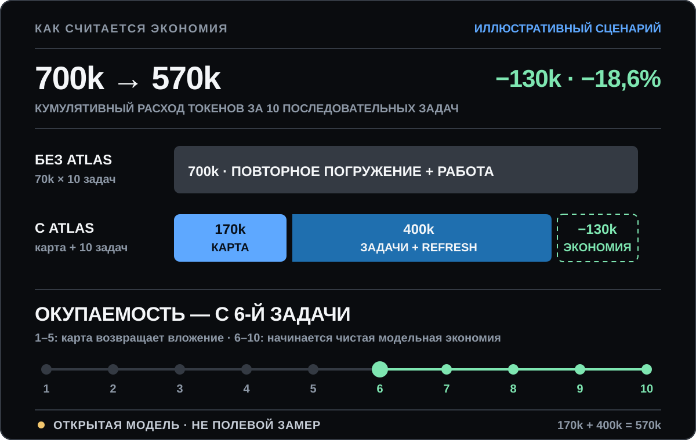

# Project Atlas

<p align="right">
  <strong>Русский</strong> · <a href="./README.md">English</a>
</p>

<p align="center">
  
</p>

<p align="center">
  <strong>Один раз изучи проект. Каждую следующую задачу начинай с проверенных фактов.</strong><br>
  Project Atlas превращает устройство продукта в обновляемую карту, готовые задачи и короткий контекст для работы.<br>
  Codex — основной адаптер. Claude Code — первый дополнительный.
</p>

<p align="center">
  <a href="#за-30-секунд">30 секунд</a>
  ·
  <a href="#почему-это-может-экономить-токены-и-время">Экономика</a>
  ·
  <a href="#что-уже-можно-проверить">Доказательства</a>
  ·
  <a href="#за-5-минут-до-первого-запроса">Запуск за 5 минут</a>
  ·
  <a href="#что-делать-с-картой-дальше">Что дальше</a>
  ·
  <a href="#технический-уровень">Технический уровень</a>
</p>

## За 30 секунд

Новая сессия ИИ обычно начинает с нуля: ищет точки запуска, читает одни и те
же файлы, восстанавливает связи, уточняет границы и только потом делает
работу. При следующей задаче часть этого пути повторяется.

**Atlas делает первое исследование повторно используемым активом проекта.**
Он сохраняет не пересказ чата, а проверяемую карту кода, данных, прав,
фоновых процессов, тестов, рисков и продуктового направления. У каждого
важного вывода есть исходный файл и честная метка:
`CONFIRMED`, `INFERENCE`, `HYPOTHESIS`, `TARGET` или `UNKNOWN`.

После создания карты работа выглядит так:

1. Atlas предлагает готовую Future Task — карточку будущей работы с результатом,
   границами, тем, что специально не входит в задачу, и критериями приёмки.
2. Для выбранной задачи агент собирает короткий **Task Context Packet** — только
   нужные факты, файлы, риски и проверки.
3. Перед правкой он перечитывает точные источники, а не слепо доверяет старой
   карте.
4. После изменения запускает тесты и обновляет карту. Следующая сессия получает
   уже новое проверенное состояние.

```text
КАРТА → ГОТОВАЯ ЗАДАЧА → НУЖНЫЙ КОНТЕКСТ → ПРАВКА → ТЕСТЫ → НОВАЯ КАРТА
```

Atlas **не меняет продуктовый код во время картирования** и **не запускает
будущие задачи сам**. Сначала он создаёт основу для работы; конкретную задачу
выбирает пользователь.

### Что станет проще

| Без Atlas | С Atlas |
| --- | --- |
| Каждая новая сессия снова знакомится с проектом | Найденные связи остаются в проекте и переносятся между сессиями |
| Чтобы исправить баг, агент читает всё подряд | Task Context Packet оставляет только файлы и факты выбранной задачи |
| «Добавь функцию» не объясняет границы | Future Task уже содержит результат, границы, исключения, риски и приёмку |
| Догадка легко превращается в уверенный ответ | Факт, вывод, цель и неизвестное не смешиваются |
| После изменения старое знание остаётся в чате | Источники перепроверяются, а карта обновляется после тестов |
| Передача другому агенту начинается с пересказа | Codex и Claude Code читают один независимый протокол |

### Кому это нужно

**Ставь Atlas**, если у продукта впереди серия багфиксов, функций,
рефакторингов, миграций, аудитов или передача между людьми и AI-сессиями.
Чем дольше живёт проект и чем дороже ошибка, тем полезнее сохранённый контекст.

**Не ставь Atlas ради одной очевидной правки** в маленьком скрипте. На первой
задаче карта добавляет расход. Она окупается только тогда, когда найденное
знание используется снова.

## Почему это может экономить токены и время

### Главный ориентир

В **иллюстративном сценарии** открытой модели на десять следующих задач:

| | Без Atlas | С Atlas |
| --- | ---: | ---: |
| Разовое построение карты | 0 | 170 000 токенов |
| Одна следующая задача | 70 000 токенов | 35 000 токенов |
| Обновление карты после задачи | 0 | 5 000 токенов |
| **Итого за 10 задач** | **700 000** | **570 000** |

**Результат модели: на 130 000 токенов меньше, или экономия 18,6%.
Разовый расход окупается на 6-й задаче.**

В исходном JSON этот сценарий называется `illustrative_mid`: он находится
между плохим и оптимистичным заданными примерами, но не является средним или
типичным результатом пользователей.

<p align="center">
  
</p>

Это не магия: без Atlas повторное знакомство входит в цену каждой задачи. С
Atlas есть дорогой первый платёж за карту, зато следующая работа начинается с
короткого пакета контекста и точечной перепроверки.

### Как читать плюс и минус

- **−18,6%** значит экономию: `700 000 → 570 000`, потрачено на `130 000`
  токенов меньше.
- **−51,1%** значит лучший модельный сценарий: `900 000 → 440 000`, потрачено
  на `460 000` токенов меньше.
- **+40,0%** значит перерасход, а не экономию: `600 000 → 840 000`, Atlas
  потребовал на `240 000` токенов больше. Это сценарий, где карту строить
  слишком дорого, а повторно использовать почти нечего.

Поэтому обещание не «Atlas всегда экономит». Обещание такое: **перед стартом
видна цена карты, после неё знание не приходится покупать заново вслепую, а
открытая модель показывает, когда эта инвестиция имеет смысл.**

[Открыть все допущения, формулы и сценарии](./docs/effectiveness.ru.md)

## Что уже можно проверить

### Сам Project Atlas

| Проверка | Публичный результат |
| --- | --- |
| Полный цикл | **1** воспроизводимая цепочка: исходники → карта → задача → патч → тест → обновлённая карта |
| Поиск правильного слоя | **3 файла → 1 готовая задача** в общем слое записи данных, которым пользуются API и фоновый процесс |
| Проверяемое изменение | **2 строки патча → 4 проверенных результата**: два пустых значения отклонены, две корректные записи сохранены |
| Выбор глубины | **3/3** заранее заданных режима выбраны верно на синтетических проектах |
| Заданные связи | **26/26** ожидаемых соответствий найдены на тех же проектах |
| Реальная экономия | **0** опубликованных парных кампаний на реальных репозиториях; проценты выше пока являются `MODELLED_ASSUMPTION` |

[Открыть доказанный цикл целиком](./docs/case-study.ru.md)

### Почему сама проблема реальна

- В исследовании Microsoft **2005 года** **66%** разработчиков сообщили, что им трудно
  понимать причины существующего кода, **62%** часто переключались между
  задачами, а **61%** — узнавать об изменениях в других частях системы.
  [Источник](https://www.microsoft.com/en-us/research/publication/software-development-at-microsoft-observed/).
- RepoCoder улучшил baseline in-file completion более чем на **10%** во всех
  показанных настройках за счёт итеративного поиска контекста репозитория.
  [Исследование](https://arxiv.org/abs/2303.12570).
- CodePlan с планированием и контекстом репозитория справился с задачами в
  **5 из 7** изученных репозиториев; базовый подход — в **0 из 7**.
  [Исследование](https://www.microsoft.com/en-us/research/publication/codeplan-repository-level-coding-using-llms-and-planning-2/).
- METR получил важный обратный результат: опытные разработчики с AI выполняли
  изученные задачи на **19% дольше**. Сам факт наличия AI ещё не гарантирует
  ускорение; цена контекста и проверки имеет значение.
  [Исследование](https://metr.org/Early_2025_AI_Experienced_OS_Devs_Study-paper.pdf).

Это доказательства важности контекста и планирования в соседних подходах, а не
измерение Atlas. **Ещё не измерено** на реальных пользователях: сколько именно
Atlas экономит времени и токенов, насколько точнее выбирает контекст и как
меняет процент успешно выполненных задач.

> [!IMPORTANT]
> Project Atlas — проект сообщества, а не официальный продукт OpenAI или
> Anthropic. Содержимое проекта обрабатывается по правилам выбранного сервиса.
> Структурно валидная карта всё равно может содержать ошибочный вывод, поэтому
> важные решения должен проверять человек.

## За 5 минут до первого запроса

Пять минут считаются после установки нужных инструментов и входа в Codex.
Это не обещание, что готовая карта появится ровно через пять минут.
Длительность исследования зависит от проекта, режима, модели и разрешений.

> [!NOTE]
> На Windows сначала открой WSL и выполняй весь этот раздел внутри него.
> Команды ниже рассчитаны на Терминал macOS или WSL; нативный PowerShell
> в v0.1.1 не проверен.

### 1. Проверь инструменты

Открой Терминал:

```bash
codex --version
git --version
python3 --version
rg --version
```

Нужны Codex CLI, Git, Python 3.10+ и ripgrep (`rg`). Все четыре команды должны
показать версию.

Если команда не найдена, открой официальную страницу установки:
[Codex CLI](https://developers.openai.com/codex/cli),
[Git](https://git-scm.com/downloads/),
[Python](https://www.python.org/downloads/) или
[ripgrep](https://github.com/BurntSushi/ripgrep#installation).

Проверь вход в Codex:

```bash
codex login status
```

Если входа нет, запусти `codex login` и заверши авторизацию в браузере.

### 2. Скопируй безопасный учебный проект

```bash
git clone https://github.com/ddenny-s/project-atlas.git atlas-first-map
cp -R atlas-first-map/tests/fixtures/quick_cli atlas-quick-demo
cd atlas-quick-demo
```

`atlas-quick-demo` — маленькая программа без сети, базы и рабочих данных.
Команда `ls` в этой папке должна показать `README.md` и `quick_cli`.

### 3. Установи Atlas для Codex

```bash
codex plugin marketplace add ddenny-s/project-atlas
codex plugin add project-atlas@project-atlas
codex plugin list
```

В списке должен появиться `project-atlas`.

### 4. Запусти Codex в этой папке

```bash
codex
```

Отправь:

```text
Используй $project-atlas:map-project.
Считай текущую папку (`.`) корнем проекта и не поднимайся выше.
Создай и проверь QUICK-карту с `--project .`.
Не меняй код проекта.
```

Atlas задаст стартовые вопросы, покажет прогноз токенов, изучит разрешённые
файлы, покажет черновик и задаст финальные вопросы.

### 5. Проверь результат

В папке появится:

```text
PROJECT_ATLAS.md
```

Успешная структурная проверка завершается результатом такого вида:

```json
{"artifacts": 1, "mode": "QUICK", "status": "valid", "validation": "completion"}
```

`valid` означает, что обязательные разделы и ссылки прошли автоматические
проверки. Это не означает, что каждое предложение ИИ автоматически стало
истиной.

### 6. Повтори на своём проекте

Закрой учебный Codex, открой Терминал в папке настоящего проекта и снова
запусти `codex`:

```bash
cd "/замени/на/полный/путь/к/проекту"
codex
```

Отправь:

```text
Используй $project-atlas:map-project.
Считай текущую папку (`.`) корнем проекта и не поднимайся выше.
Сначала предложи QUICK, STANDARD или FORENSIC, покажи прогноз токенов
и дождись моего подтверждения. Затем создай и проверь карту.
Не меняй код проекта.
```

<details>
<summary><strong>Короткий словарь перед стартом</strong></summary>

- **Репозиторий** — папка проекта вместе с историей изменений.
- **Корень проекта** — верхняя папка именно того кода, который надо изучить.
- **Плагин** — устанавливаемое дополнение для Codex или Claude Code.
- **QUICK** — короткий режим Atlas для небольшого проекта или первого знакомства.
- **Токен** — небольшая часть текста, которой модель измеряет обработанный объём; это не процент подписки.
- **Будущая задача** — карточка работы, которую Atlas подготовил, но не выполнил.
- **Worker** — часть программы, которая делает работу в фоне.
- **Fixture** — маленький тестовый проект или заранее подготовленные данные.
- **Oracle** — заранее известный правильный ответ для проверки результата.
- **Task Context Packet** — короткая выжимка из карты для одной задачи. По
  умолчанию агент показывает её в чате; сохранение в `.md` нужно попросить
  отдельно.
- **Non-goals** — работа, которая специально не входит в задачу.

</details>

## Сквозной пример: карта → задача → исправление

<p align="center">
  
</p>

Публичный учебный сервис принимает посылки через API и обрабатывает доставку
фоновым worker. Оба пути пишут в одну SQLite-таблицу.

До карты:

- API отклоняет пустой `parcel_id`;
- worker такую проверку обходит;
- общий писатель сохраняет строку из пробелов как настоящий идентификатор.

Воспроизводимый результат:

```text
api blank: rejected (parcel_id is required)
worker blank: ('   ', 'delivered', 'worker')
```

Карта отделяет три вещи:

```text
CURRENT · CONFIRMED — API проверяет parcel_id.
CURRENT · CONFIRMED — worker доходит до общего writer без проверки.
CURRENT · UNKNOWN   — порядок событий провайдера после тайм-аута не доказан.
```

Затем она создаёт `ATLAS-001 · TARGET · READY`: перенести обязательную
проверку в общий слой, не трогать ретраи и права администратора, проверить
пустой и корректный идентификаторы.

Публичный тест применяет минимальный патч только к временной копии fixture и
доказывает:

```text
api blank: rejected (parcel_id is required)
worker blank: rejected (parcel_id is required)
valid: [('parcel-7', 'delivered', 'worker'),
        ('parcel-api', 'accepted', 'api')]
```

После этого квитанция задачи получает `VERIFIED`, а строка будущей задачи —
`SUPERSEDED`. Неизвестное про провайдера остаётся `UNKNOWN`: карта не закрывает
пробел, который исправление не исследовало.

[Открыть весь пример: исходники → карта → Context Packet → патч → тест → обновлённая карта](./docs/case-study.ru.md)

[Замороженная карта «до»](./docs/case-study-artifacts/standard-service/before/PROJECT_ATLAS.md)
· [Task Context Packet](./docs/case-study-artifacts/standard-service/ATLAS-001-context-packet.md)
· [Точный патч](./docs/case-study-artifacts/standard-service/ATLAS-001.patch)
· [Замороженная карта «после»](./docs/case-study-artifacts/standard-service/after/PROJECT_ATLAS.md)

## Что делать с картой дальше

### Выбрать одну работу

В QUICK открой раздел Future Tasks в `PROJECT_ATLAS.md`. В STANDARD или
FORENSIC начни с `ATLAS_INDEX.md`, `LIVE_HANDOFF.md` и Future Tasks в
`MIGRATION_PLAN.md`.

Перед изменениями агент собирает короткий **Task Context Packet**:

1. выбранная задача и критерии приёмки;
2. связанные `CURRENT`-утверждения;
3. конкретные исходные файлы;
4. важные `UNKNOWN` и границы полномочий;
5. обязательные проверки;
6. результат проверки свежести ссылок;
7. явно исключённый контекст.

Так большая карта не превращается в огромный prompt. Следующая сессия получает
только контекст, который нужен для выбранной задачи, и видит, что было
исключено.

По умолчанию команда «покажи Task Context Packet» означает вывод в чате, а не
новый файл. Чтобы передать пакет в другую сессию, добавь: «и сохрани его как
`TASK_CONTEXT_<Task-ID>.md`». В сквозном примере пакет специально
[сохранён отдельным файлом](./docs/case-study-artifacts/standard-service/ATLAS-001-context-packet.md),
чтобы его можно было проверить.

### Отправить простой запрос

```text
Открой карту Atlas и выбери задачу <Task ID>.
Сначала проверь, что её ссылки ещё актуальны.
Покажи короткий Task Context Packet: задача, связанные факты, файлы,
неизвестное, проверки и исключения.
Затем выполни только эту задачу, запусти проверки и обнови карту.
Не закрывай UNKNOWN без нового доказательства.
```

### Для чего это полезно

| Следующая работа | Как помогает карта |
| --- | --- |
| Исправить баг | Показывает вероятный путь причины, связанные состояния и тесты |
| Добавить функцию | Отделяет затрагиваемые слои от non-goals |
| Провести рискованный рефакторинг | Сохраняет текущие связи, права и пути отката |
| Передать проект | Даёт проверяемые ссылки вместо пересказа из старого чата |
| Начать новую AI-сессию | Уменьшает повторное знакомство, если карта свежая |

Карта может сделать работу хуже, если она устарела или поверхностна. Поэтому
ссылки перепроверяются до изменения, а карта обновляется после него.

## Что происходит внутри Atlas

1. **BOUND** — определяет корень, исключения, продуктовую цель и цену ошибки.
2. **FORECAST** — до каждого большого блока показывает минимум, обычный расход и максимум модельных токенов.
3. **DISCOVER** — находит точки запуска, потоки, состояние, права, тесты и внешние связи.
4. **CLASSIFY** — разделяет факт, вывод, гипотезу, цель и неизвестное.
5. **ALIGN** — показывает черновик владельцу и задаёт только вопросы, способные изменить карту или будущие задачи.
6. **DELIVER** — создаёт карту, Future Tasks, handoff и запускает структурную проверку.

Вопросов нет фиксированного количества. Atlas задаёт их небольшими блоками,
пока следующий ответ ещё может изменить границу, риск, направление продукта
или задачу. Каждый вопрос показывает четыре варианта; четвёртый —
«Другое — напишу сам».

Состояния ответа не смешиваются:

- `UNAVAILABLE` — пользователь не знает;
- `SKIPPED` — пользователь осознанно пропустил;
- `STOP_USER` — пользователь остановил опрос;
- `UNKNOWN:<stable-id>` — материальный пробел остался открытым.

Ответ владельца получает происхождение `USER_INPUT`. Он может подтвердить
цель, но не превращает техническую догадку о текущем коде в `CONFIRMED`.

## Три уровня глубины

| Режим | Для чего | Результат |
| --- | --- | --- |
| `QUICK` | Маленький проект или первое знакомство | Один `PROJECT_ATLAS.md` |
| `STANDARD` | Живое приложение, сервис или библиотека | Маршрутизированная карта текущего и целевого состояния |
| `FORENSIC` | Критичная, старая, запутанная или чувствительная система | Полные реестры, знаменатели покрытия, снимок источников и независимое оспаривание |

Размер репозитория не выбирает режим сам. Важнее цена ошибки, рабочие данные,
количество процессов и хранилищ, автоматические решения и права доступа.

[Точные правила выбора](./docs/depth-levels.ru.md) ·
[Контракт результатов](./docs/outputs.ru.md)

## Опросы, токены и модель

До каждого содержательного блока Atlas показывает:

| Оценка | Значение |
| --- | --- |
| Минимум | Нижняя рабочая граница при небольшом числе неизвестных |
| Обычно | Основной ориентир, не среднее по всем пользователям |
| Максимум | Точка остановки и нового прогноза |

Для публичного `quick_cli` встроенная модель сейчас даёт
**2 500 / 3 600 / 5 500 модельных токенов** на весь QUICK-цикл. Это прогноз
по размеру разрешённых файлов, не обещание расхода.

Если интерфейс показывает точный недельный остаток, Atlas может повторить его.
Если точного сигнала нет, строки нет. Atlas не пересчитывает токены в
выдуманный процент подписочного лимита.

### Стартовая модель и effort

Проверено по официальным справкам **2026-07-27**. Это отправная точка, а не
Atlas benchmark:

| Режим | Codex — основной адаптер | Claude Code — дополнительный |
| --- | --- | --- |
| `QUICK` | GPT-5.6 Terra, `medium` | `sonnet`, `high` |
| `STANDARD` | GPT-5.6 Sol, `high` | `opus`, `high` |
| `FORENSIC` | GPT-5.6 Sol, `xhigh` | `best`, `xhigh` |

OpenAI описывает GPT-5.6 Sol как вариант максимальной силы, Terra — как баланс
качества и цены, а `medium` — как сбалансированную стартовую точку. `high`,
`xhigh` и `max` стоит повышать только когда проверка показывает пользу.

В Claude Code `best` использует Fable 5, если у организации есть доступ; иначе
выбирает последний Opus. Псевдоним зависит от провайдера. На Anthropic API и
Claude Platform on AWS `opus` сейчас выбирает Opus 5; Opus 5 требует Claude Code
2.1.219+. В Claude Code 2.1.207 псевдоним указывал на Opus 4.8, поэтому Atlas
записывает alias, провайдера, фактическую модель и версию.

`ultracode` — настройка Claude Code только на текущую сессию, а не уровень
Atlas: она включает `xhigh` и динамические рабочие процессы. Форма
`--effort ultracode` требует
Claude Code 2.1.203+. Использовать её стоит для отдельного тяжёлого блока в
рамках явно согласованного бюджета. `ultrathink` усиливает один ход и не меняет
effort, передаваемый API. Codex остаётся основным адаптером.

Источники:
[OpenAI — Using GPT-5.6](https://developers.openai.com/api/docs/guides/latest-model),
[Claude Code — model configuration](https://code.claude.com/docs/en/model-config),
[Anthropic — model and effort](https://claude.com/blog/claude-model-and-effort-level-in-claude-code),
[Anthropic — dynamic workflows](https://claude.com/blog/introducing-dynamic-workflows-in-claude-code).

## Эффективность без маркетинговой математики

Крупные цифры на первом экране — это прогноз открытой модели, а не скрытая
«маркетинговая статистика». Вот весь расчёт токенов без сокращений:

| Сценарий · 10 задач | Цена карты | Одна задача без Atlas | Одна задача после карты, включая обновление | Итого без → с Atlas | Результат | Окупаемость |
| --- | ---: | ---: | ---: | ---: | ---: | ---: |
| Плохой · `MODELLED_ASSUMPTION` | 300k | 60k | 54k | 600k → 840k | **+40,0% расхода** | 50-я задача |
| Иллюстративный · `MODELLED_ASSUMPTION` | 170k | 70k | 40k | 700k → 570k | экономия **18,6%** | 6-я задача |
| Оптимистичный · `MODELLED_ASSUMPTION` | 120k | 90k | 32k | 900k → 440k | экономия **51,1%** | 3-я задача |

Иллюстративная строка означает две разные вещи:

- после построения карты модельная цена каждой следующей задачи падает с
  `70k` до `40k`, то есть на **42,9%**;
- сначала надо вернуть `170k`, потраченные на карту, поэтому чистая экономия
  появляется не сразу, а на шестой задаче.

Вот почему плохой сценарий показывает `+40,0%`: повторная работа дешевеет всего
на `6k` за задачу, а карта стоит `300k`. За десять задач она ещё не вернула
вложение. На 50-й задаче обе стороны доходят до `3 000k`.

Время считается отдельно:

| Сценарий · 10 задач | Цена карты | Одна задача без Atlas | Одна задача после карты | Итого без → с Atlas | Результат | Окупаемость |
| --- | ---: | ---: | ---: | ---: | ---: | ---: |
| Плохой | 240 мин | 25 мин | 23 мин | 250 → 470 мин | расход **+88,0%** | 120-я задача |
| Иллюстративный | 120 мин | 30 мин | 16 мин | 300 → 280 мин | экономия **6,7%** | 9-я задача |
| Оптимистичный | 75 мин | 40 мин | 12 мин | 400 → 195 мин | экономия **51,2%** | 3-я задача |

Формула простая:

```text
Без Atlas = число задач × полная цена одной задачи

С Atlas = цена первой карты
          + число задач × (работа с готовым контекстом + обновление карты)
```

Входы лежат в
[`benchmarks/data/modelled/v0.1.0.json`](./benchmarks/data/modelled/v0.1.0.json),
а рассчитанный результат — в
[`modelled-v0.1.0.json`](./benchmarks/data/derived/modelled-v0.1.0.json).
Любой человек может заменить допущения своими и повторить расчёт.

Окупаемость определена только при положительной экономии на одной задаче. При
нулевой или отрицательной экономии калькулятор возвращает `null`: в этой
модели окупаемость не достигается. При нулевом baseline относительное
улучшение тоже возвращает `null`, а не бесконечность или выдуманный процент.

У Atlas пока нет опубликованной парной кампании на реальных задачах. Поэтому
ни один процент выше не называется измеренным результатом.

[Все сценарии, человеческое объяснение и внешние исследования](./docs/effectiveness.ru.md)
· [Технический benchmark-контракт](./benchmarks/README.md)
· [Реестр внешних evidence](./benchmarks/EXTERNAL_EVIDENCE.md)

## Плюсы, минусы и границы

| Плюсы | Минусы |
| --- | --- |
| Проверяемые ссылки вместо уверенного пересказа | Первичное исследование тратит токены и время |
| Готовые задачи с границами и приёмкой | Неверная или устаревшая карта может направить работу не туда |
| Переносимость между сессиями и агентами | Динамический код и внешние сервисы могут скрыть связи |
| Явные UNKNOWN вместо заполнения пробелов | Валидатор проверяет структуру, а не абсолютную истинность |

Atlas особенно полезен перед рефакторингом, миграцией, передачей проекта,
аудитом прав и данных или серией будущих изменений. Для маленького понятного
скрипта с хорошим README он часто не нужен.

Правила безопасности:

- не читать и не публиковать секреты, ключи и реальные выгрузки;
- не считать разрешение на карту разрешением менять код, данные или production;
- расширять чтение только после безопасного инвентаря;
- независимо перепроверять высокорисковые выводы;
- обновлять карту после материальных изменений.

[SECURITY.md](./SECURITY.md) ·
[Модель доказательств](./core/skill/map-project/references/evidence-model.md)

## Технический уровень

Нормативный контракт не повторяется в README. Он живёт в `core/`; документы
ниже объясняют и индексируют его:

- [Технический индекс на русском](./docs/README.ru.md)
- [Протокол](./core/PROTOCOL.md)
- [Методология и evidence](./docs/methodology.ru.md)
- [Режимы глубины](./docs/depth-levels.ru.md)
- [Контракт результатов](./docs/outputs.ru.md)
- [Примеры запросов](./docs/examples.ru.md)
- [Адаптеры, модели и установка](./docs/adapters.ru.md)
- [Сквозной пример](./docs/case-study.ru.md)

Канонический протокол независим от host:

```text
core/                 доказательства, workflow, безопасность, outputs
adapters/codex/       основной нативный пакет
adapters/claude-code/ первый дополнительный пакет
```

<details>
<summary><strong>Claude Code, прямая установка, обновление и удаление</strong></summary>

Claude Code:

```bash
claude plugin marketplace add ddenny-s/project-atlas
claude plugin install project-atlas@project-atlas
```

Вызов: `/project-atlas:map-project`.

Прямая установка на macOS или Linux:

```bash
git clone https://github.com/ddenny-s/project-atlas.git
cd project-atlas
./scripts/install.sh --user-scope
# или:
./scripts/install-claude.sh
```

Прямой вызов: `$map-project` для Codex, `/map-project` для Claude Code.

Обновление прямой установки:

```bash
git pull --ff-only
./scripts/install.sh --user-scope --force
# или:
./scripts/install-claude.sh --force
```

Плагин удаляется штатными командами host. У прямой установки v0.1.1 нет
отдельно проверенной команды удаления или ручного восстановления из backup.
Не импровизируй с рекурсивными `mv`, `cp` или `rm`: используй плагин, если
нужен простой lifecycle.

</details>

## Разработка и релиз

```bash
python3 scripts/sync_adapters.py --check
python3 -m unittest discover -s tests -v
git diff --check
```

Перед тегом или GitHub Release сопровождающие отдельно проверяют одноразовые
чистые профили, пути с пробелами, оба адаптера, результат каждого режима и
независимые ревью. Этот ручной гейт обязателен до создания тега версии или
GitHub Release и не считается проверкой GitHub Actions. CI необходимо, но
одного зелёного CI для релиза недостаточно.

[CONTRIBUTING.md](./CONTRIBUTING.md) · [MIT License](./LICENSE)
